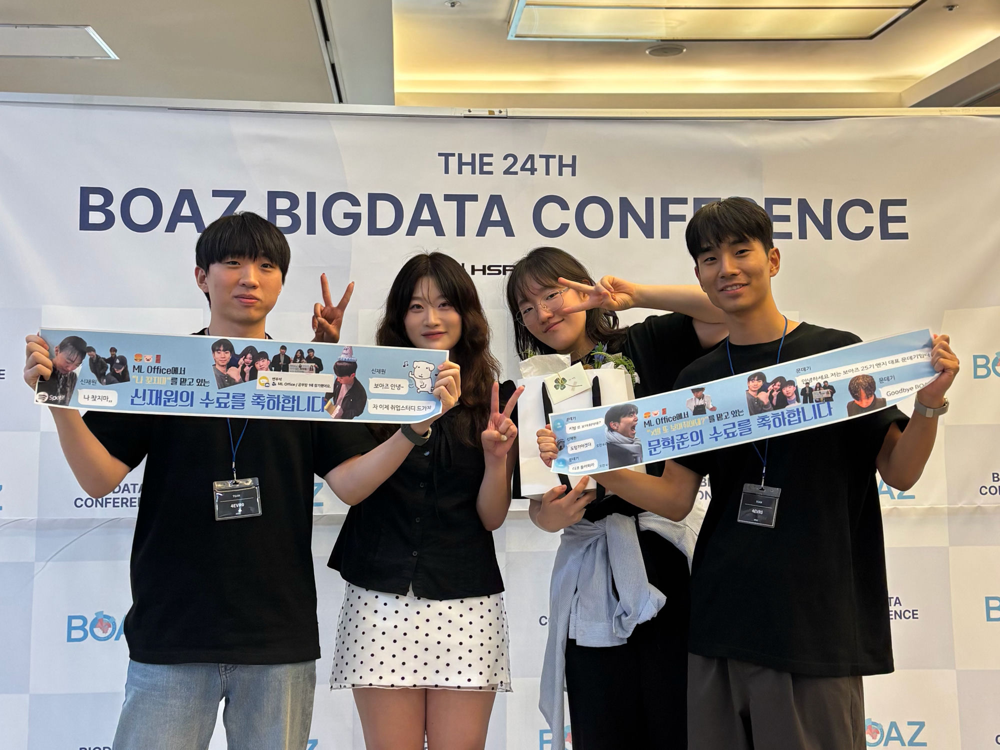
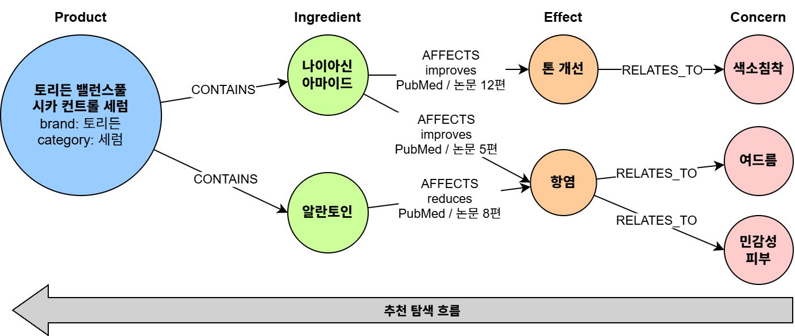
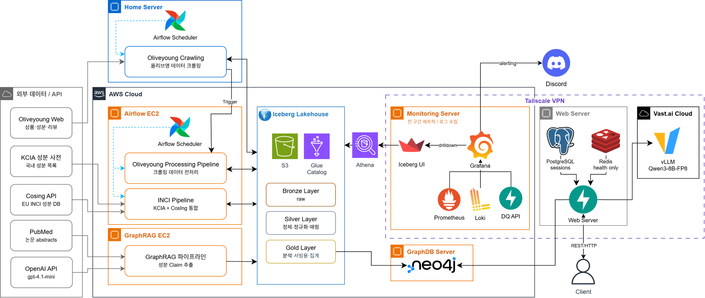

<div align="center">

# 4EVR0

**성분 근거로 설명하는 화장품 추천 — KG-RAG 기반 추천 시스템**

*제 24회 BOAZ 빅데이터 컨퍼런스 발표 · 데모 부스 진행*

[**📊 발표 자료 (PPT)**](https://www.slideshare.net/slideshow/24-boaz-4evr0-kg-rag-llmops/288912452) · [**🖼️ 포스터**](https://www.slideshare.net/slideshow/24-boaz-4evr0-kg-rag-llmops-048b/288947440)

</div>

---

## 🏆 성과

- **제 24회 BOAZ 빅데이터 컨퍼런스** 발표 및 데모 부스 진행
- 성분 매칭 정합성 **상시 95%+ 유지** (평상 ≈ 99.1%, 95% 미만 시 알람) — 실패는 DLQ로 격리해 파이프라인 무중단
- 관측 대상 **5개 이기종 환경을 단일 Grafana로 통합**, 알람 룰 12종(오케스트레이션 2 · 데이터 정합성 6 · 시스템 4)을 as-code로 관리
- 성분 매칭을 **Aho-Corasick**(사전 2.6만 키)으로 O(n·m)→O(n+m) 개선 — 사전 완전탐색 대비 약 **200배** 속도, 결과 동일성은 실데이터 전건 검증

---

## 👥 Team

<div align="center">

|  |  |  |  |
| :---: | :---: | :---: | :---: |
| **신재원** | **위지우** | **김서연** | **문혁준 (팀장)** |
| [@jaewonnow](https://github.com/jaewonnow) | [@withya16](https://github.com/withya16) | [@seoyeon83](https://github.com/seoyeon83) | [@likell1](https://github.com/likell1) |
| Data Engineer | Data Engineer | Data Engineer<br>Infra/Cloud Engineer | MLOps Engineer |



</div>

---

## 💡 Why KG-RAG?

화장품 추천은 **"이 성분이 왜 내 고민에 맞는지"를 설명할 수 있어야** 신뢰를 얻습니다. 성분–효능–피부고민은 본질적으로 관계 데이터라, 벡터 유사도만 쓰는 일반 RAG로는 연결 근거를 되짚기 어렵습니다. 그래서 `Product –CONTAINS→ Ingredient –AFFECTS→ Effect –RELATES_TO→ Concern` 지식그래프를 얹어, 피부 고민에서 **역방향으로 탐색**해 근거 논문 수까지 붙은 성분·제품을 설명 가능한 형태로 추천합니다.

<div align="center">

</div>

```
사용자의 피부 고민 (자연어)
    → LLM이 고민·피부타입 추출
    → 지식그래프에서 Concern → Effect → Ingredient → Product 역탐색
    → 근거(효능·논문 수)와 함께 LLM이 추천 답변 생성 (SSE 스트리밍)
```

---

## ⚙️ 시스템 한눈에

<div align="center">

</div>

| 영역 | 요약 |
| --- | --- |
| **데이터 파이프라인** | 올리브영(크롤링) · KCIA/EU CosIng 성분 표준 · PubMed 논문 5,506편 → **Iceberg 레이크하우스(Bronze/Silver/Gold)**. 실패 행은 버리지 않고 `silver_error`(DLQ)에 유형별 적재해 **품질 개선 큐**로 활용 |
| **CDC → 지식그래프** | 원천 로그 없는 외부 데이터를 **Iceberg 스냅샷 비교(N-1 vs N)**로 변경 감지, Neo4j에 **변경분만 증분 반영**. Product 3,141 · Ingredient 3,221 · CONTAINS 112,966 · Claim 5,387 |
| **오케스트레이션** | Airflow DAG 4종, 재실행 단위 = 태스크 경계(DockerOperator). 홈서버 크롤 DAG가 **REST API로 EC2 파이프라인을 트리거**, `batch_date` 관통 키로 멱등 보장 |
| **인프라** | AWS EC2 3대 + S3/Glue/Athena, 홈서버, Vast.ai GPU를 **Tailscale VPN**으로 연결. GitHub Actions **OIDC 키리스 CI/CD**, SSM 배포, Athena 비용 가드레일 |
| **통합 모니터링** | 성격이 다른 4가지 수집 경로(Prometheus pull · Alloy push · Neo4j 직접 질의 · dq_api)를 **단일 Grafana**로 통합, 정합성 패널에서 **Athena 드릴다운**으로 원본 행 조회 |
| **LLMOps** | 단일 GPU(vLLM · Qwen 8B)에서 체감 지연 **11.8s→2.7s**, 과부하 실패율 **8.7%→0%**, AWQ 양자화로 decode **2.4×**, **eval-in-CI**로 품질 회귀 자동 차단 |

---

## 📦 Repositories

### 데이터 파이프라인

| 레포 | 설명 |
| --- | --- |
| [Oliveyoung_Crawling](https://github.com/4EVR0/Oliveyoung_Crawling) | 올리브영 베스트 상품 Playwright 크롤러 |
| [Oliveyoung_Pipeline](https://github.com/4EVR0/Oliveyoung_Pipeline) | 올리브영 성분 데이터 Bronze→Silver→Gold Iceberg ETL (CDC 기반 Neo4j 증분 반영) |
| [INCI_Pipeline](https://github.com/4EVR0/INCI_Pipeline) | KCIA·EU CosIng 성분 표준 사전 ETL (월간 갱신) |
| [GraphRAG_Pipeline](https://github.com/4EVR0/GraphRAG_Pipeline) | PubMed 논문에서 성분–효능 Claim 추출 파이프라인 |
| [oliveyoung_common](https://github.com/4EVR0/oliveyoung_common) | 공통 유틸 패키지 (batch, logging, s3_paths) |

### 서빙 · 앱

| 레포 | 설명 |
| --- | --- |
| [4EVR0-Server](https://github.com/4EVR0/4EVR0-Server) | WAS 서버 + LLMOps 운영 (계측·부하테스트·eval·품질 게이트) |
| [GraphDB-Server](https://github.com/4EVR0/GraphDB-Server) | 상품–성분–효능–피부고민 지식그래프 (Neo4j) |
| [GPU_Serving_Infra](https://github.com/4EVR0/GPU_Serving_Infra) | vLLM GPU 서빙 프로비저닝 (Vast.ai · 콜드스타트 최적화) |

### 인프라 · 운영

| 레포 | 설명 |
| --- | --- |
| [Airflow_Infra](https://github.com/4EVR0/Airflow_Infra) | 데이터 파이프라인 Airflow 운영 환경 |
| [Monitoring_Infra](https://github.com/4EVR0/Monitoring_Infra) | Prometheus·Grafana·Loki 통합 관측 스택 (알람 as-code) |
| [Terraform_Infra](https://github.com/4EVR0/Terraform_Infra) | AWS 인프라 IaC |
| [Iceberg_UI](https://github.com/4EVR0/Iceberg_UI) | Iceberg 메타데이터 테이블 조회 UI |

---

## 🛠 Tech Stack

<div align="center">


</div>
